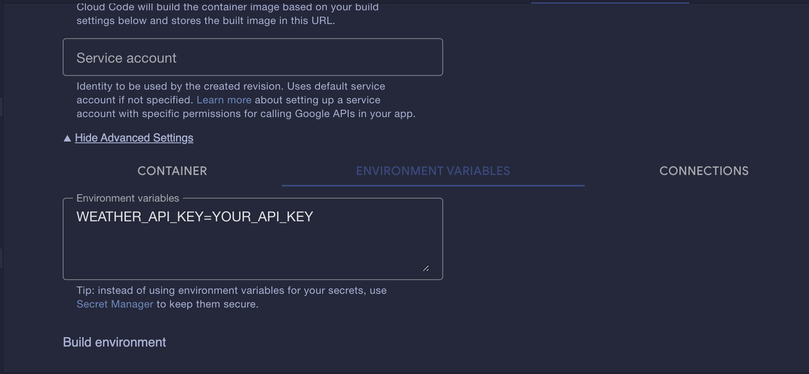

# Desafio Deploy no Cloud Run - Pós graduação GoExpert FullCycle
## Descrição
Desenvolver uma API que receba um CEP e retorne a temperatura da localidade do CEP em celsius, fahrenheit e kelvin.

## Requisitos
- [x] O CEP deve possuir 8 dígitos.
- [x] A API deve buscar a localidade do CEP em uma API externa.
- [x] A API deve buscar a temperatura da localidade em uma API externa.
- [x] A API deve retornar um JSON com três temperaturas: celsius, fahrenheit e kelvin.
- [x] Para CEPs inválidos, a API deve retornar o status 422.
- [x] Para CEPs não encontrados a API deve retornar o status 404.
- [x] A API deve ser deployada no Cloud Run.

## Bibliotecas
- crypto/tls: para desabilitar a verificação de certificado SSL.
- encoding/json: para codificar e decodificar JSON.
- fmt: para formatar a saída.
- log: para logar mensagens.
- net/http: para fazer requisições HTTP.
- net/url: para fazer parse de URLs.
- os.Getenv: para pegar variáveis de ambiente.
- strings.Count: para saber o tamanho da string.

## Como executar o projeto localmente sem docker
```bash
WEATHER_API_KEY=YOUR_API_KEY go run main.go
```
**Atenção**: O arquivo .env é necessário para o docker-compose e nele deve conter a chave de acesso à API do WeatherApi.

##### Exemplo de .env
```env
WEATHER_API=YOUR_API_KEY
```

**Atenção**: substitua YOUR_API_KEY pela sua chave de acesso à API do WeatherApi.

## Como executar o projeto com ambiente de desenvolvimento localmente
```bash
make dev
```
ou
```bash
docker compose -f docker-compose-dev.yml up -d --build
```

## Como executar o projeto com ambiente de produção localmente
```bash
make prod
```
ou
```bash
docker compose -f docker-compose-prod.yml up -d --build
```

## Endpoints
### GET /weather?cep=:cep
Retorna a temperatura da localidade do CEP em celsius, fahrenheit e kelvin.

#### Parâmetros
- cep: string com 8 dígitos.

#### Exemplo de requisição
```bash
curl -X GET "http://localhost:8080/weather?cep=01311000"
```

## Exemplo de resposta
```json
{
  "temp_C": 25.0,
  "temp_F": 77.0,
  "temp_K": 298.15
}
```

## Setando variáveis de ambiente no Cloud Run


## Testes de integração
```bash
docker compose up -d
go test -v ./...
=== RUN   TestWebServerSuite
=== RUN   TestWebServerSuite/TestCepNotFound
=== RUN   TestWebServerSuite/TestInvalidCepLength
=== RUN   TestWebServerSuite/TestSuccessfulRequest
--- PASS: TestWebServerSuite (1.34s)
    --- PASS: TestWebServerSuite/TestCepNotFound (0.55s)
    --- PASS: TestWebServerSuite/TestInvalidCepLength (0.00s)
    --- PASS: TestWebServerSuite/TestSuccessfulRequest (0.79s)
PASS
ok      github.com/codeis4fun/pos-go-expert/deploy-cloud-run    1.856s
```

## Endpoint para acesso no Cloud Run
[https://deploy-cloud-run-jf6n7xsyeq-uc.a.run.app/weather?cep=01001000](https://deploy-cloud-run-jf6n7xsyeq-uc.a.run.app/weather?cep=01001000)

## Autor
- [Nícholas Carballo](https://www.linkedin.com/in/nicholascarballo/)
