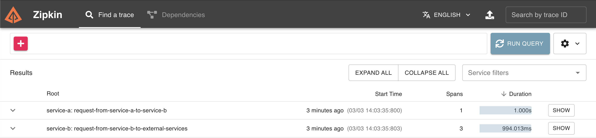
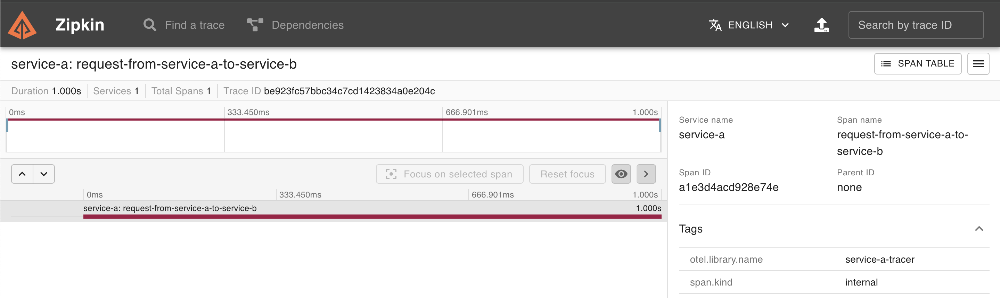
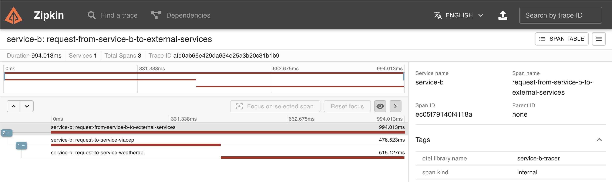

# Desafio OpenTelemetry - Pós Graduação GoExpert FullCycle

## Descrição
O desafio consiste em criar uma aplicação utilizando OpenTelemetry para monitorar as requisições HTTP feitas entre dois serviços A e B. O serviço A é um servidor HTTP que recebe requisições e faz chamadas para o serviço B. O serviço B é um servidor HTTP que recebe requisições do serviço A e faz chamadas para os serviços do VIACEP e WeatherAPI.

## Requisitos
### Serviço A
- [x] Para CEPs inválidos, a API deve retornar o status 422.
- [x] Para CEPs válidos, a API deve encaminhar a requisição para o serviço B.

### Serviço B
- [x] A API deve buscar a localidade do CEP em uma API externa.
- [x] A API deve buscar a temperatura da localidade em uma API externa.
- [x] A API deve retornar um JSON o nome da cidade e três temperaturas: Celsius, Fahrenheit e Kelvin.
- [x] Para CEPs inválidos, a API deve retornar o status 422.
- [x] Para CEPs não encontrados a API deve retornar o status 404.

**Atenção**: O arquivo .env é necessário para o docker-compose e nele deve conter a chave de acesso à API do WeatherApi.

##### Exemplo de .env
```env
WEATHER_API=YOUR_API_KEY
```

**Atenção**: substitua YOUR_API_KEY pela sua chave de acesso à API do WeatherApi.

## Como executar o projeto
```bash
docker compose up --build -d
```

## Como parar a execução do projeto
```bash
docker compose stop
```

## Endpoints
### GET /weather/:cep
Retorna o nome da localidade do CEP e a temperatura em celsius, fahrenheit e kelvin.

#### Parâmetros
- cep: string com 8 dígitos.

#### Exemplo de requisição
```bash
curl -X GET "http://localhost:8090/weather/01311000"
```

## Exemplo de resposta
```json
{
    "city": "São Paulo",
    "temp_C": 25.0,
    "temp_F": 77.0,
    "temp_K": 298.15
}
```

## Exemplo de visualização no Zipkin
### Tracing completo do serviço A para o serviço B


### Tracing completo do serviço B para os serviços externos


### Tracing do serviço B separado por requsições aos serviços externos (VIACEP e WeatherAPI)


## Autor
- [Nícholas Carballo](https://www.linkedin.com/in/nicholascarballo/)