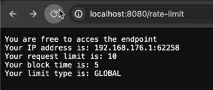

## Desafio rate-limiter - Pós graduação GoExpert FullCycle

### Descrição
Desenvolver um rate limiter para controlar a quantidade de requisições por segundo. O rate limiter deve ser implementado como um middleware para o servidor HTTP. O rate limiter deve ser configurável por meio de um arquivo de configuração. O rate limiter deve ser capaz de responder com um erro 429 quando a quantidade de requisições exceder o limite configurado. O rate limiter deve ser configurado para limitar a quantidade de requisições por IP ou por Token. A configuração de Token sobrepõe uma configuração de IP.

Prioridade de importância das configurações:
Token > IP > Default

As configurações default são lidas através do arquivo de ambiente ``.env``

### Configuração
#### .env
```
WEB_SERVER_HOST=0.0.0.0
WEB_SERVER_PORT=8080
REDIS_HOST=redis
REDIS_PORT=6379
REDIS_READ_TIMEOUT=5
REDIS_WRITE_TIMEOUT=5
RATE_LIMIT_MAX_REQUESTS=10
RATE_LIMIT_BLOCK_TIME=5
```

### Estrutura de arquivos
``````.
├── Dockerfile
├── README.md
├── api
│   └── requests.http
├── cmd
│   └── server
│       ├── configs.db
│       └── main.go
├── config
│   └── config.go
├── docker-compose.yml
├── go.mod
├── go.sum
├── internal
│   ├── httprate
│   │   └── httprate.go
│   └── webserver
│       ├── handlers.go
│       ├── webserver.go
│       └── webserver_test.go
└── pkg
    ├── cache
    │   ├── interface.go
    │   └── redis.go
    └── repository
        ├── interface.go
        ├── sqlite.go
        └── types.go
``````

#### Dockerfile
Arquivo de configuração para criar a imagem do servidor HTTP expondo a porta 8080 e importando os arquivo ``.env`` e ``.db``.

#### api/requests.http
Arquivo de requisições HTTP para testar o servidor. Contém as rotas para incluir, listar, atualizar e deletar configurações. Também inclui rotas para testar o rate limiter. O tempo de bloqueio está na unidade segundos. O campo limit_type é apenas ilustrativo para ficar mais claro o que está sendo testado.

#### cmd/server/configs.db
Banco de dados SQLite para armazenar as configurações de rate limiter.

#### cmd/server/main.go
Arquivo principal para iniciar o servidor HTTP e suas dependências: banco de dados SQLite, Redis e Middleware de rate limit. Nele também setamos as rotas para incluir, listar, atualizar e deletar configurações, além do middleware de rate limiter.

#### config/config.go
Arquivo de configuração para ler as variáveis de ambiente e configurar o rate limiter.

#### docker-compose.yml
Arquivo de configuração para criar os serviços do servidor HTTP, Redis e importar banco de dados SQLite e arquivo ``.env``.

#### go.mod
Arquivo de configuração do Go Modules.

#### go.sum
Arquivo de configuração do Go Modules.

#### internal/httprate/httprate.go
Middleware de rate limiter para controlar a quantidade de requisições por segundo. O rate limiter é configurável por meio de um arquivo de configuração e também é capaz de responder com um erro 429 quando a quantidade de requisições exceder o limite configurado. O rate limiter é configurado para limitar a quantidade de requisições por IP ou por Token. O Redis é utilizado para armazenar as requisições por IP e Token.

#### internal/webserver/handlers.go
Arquivo de configuração das rotas para incluir, listar, atualizar e deletar configurações.

#### internal/webserver/webserver.go
Arquivo de configuração do servidor HTTP.

#### internal/webserver/webserver_test.go
Arquivo de testes do servidor HTTP. Nele fazemos testes de integração para termos certeza de que o servidor está funcionando corretamente e respondendo com o erro 429 quando a quantidade de requisições exceder o limite configurado.

#### pkg/cache/interface.go
Interface para o cache. Para utilizar outro banco de dados como cache, basta criar um tipo que implemente os métodos `Set` e `Get`. Um exemplo que banco que pode substituir o Redis é o Memcached do Google Cloud.

#### pkg/cache/redis.go
Implementação do cache utilizando o Redis.

#### pkg/repository/interface.go
Interface para o repositório.

#### pkg/repository/sqlite.go
Implementação do repositório utilizando o SQLite.

#### pkg/repository/types.go
Tipos de dados para o repositório.

#### Execução
Para executar o servidor, basta rodar o comando ``docker-compose up`` na raiz do projeto. Após isso, o servidor estará disponível na porta 8080.

#### Testes
Para rodar os testes, basta rodar o comando ``go test ./... -v -count=1`` na raiz do projeto. Após isso, os testes serão executados e o resultado será exibido no terminal. O uso da flag ``-count=1`` é para garantir que os testes sejam executados sem usar o cache de testes anteriores.

#### Extras
O token `goExpert` já está configurado no banco de dados SQLite. Ele é utilizado para sobrescrever as configurações de rate limiter por Token. Está configurado para 100 requisições e um tempo de bloqueio de 5 segundos.

#### Melhorias
- Implementar testes unitários nas demais funções do projeto.
- Usar um banco de dados noSQL para armazenar as configurações do rate limiter. Ex: MongoDB.
- Uso de clean architecture para melhorar a organização do projeto caso fosse um projeto maior e necessitasse de mais escalabilidade.
- Uso do pacote context para cancelar as requisições quando o rate limiter bloquear o acesso e também para cancelar as requisições quando o servidor for desligado. Outro ponto importante é em relação às queries rodadas no banco de dados, que podem ser canceladas quando o servidor for desligado ou o usuário cancelar a requisição.


#### Ilustração

### Autor
- [Nícholas Carballo](https://www.linkedin.com/in/nicholascarballo/)